<p align="center">
  
</p>

<h3 align="center">Self-managing Kubernetes clusters with zero-trust networking</h3>

<p align="center">
  <em>Provision entire cluster hierarchies that survive their parent, enforce bilateral service agreements, and manage your fleet from a single CLI.</em>
</p>

<p align="center">
  <a href="#quick-start">Quick Start</a> &bull;
  <a href="#cli-reference">CLI Reference</a> &bull;
  <a href="#service-networking">Service Mesh</a> &bull;
  <a href="#cedar-policies">Cedar Policies</a> &bull;
  <a href="#secrets">Secrets</a> &bull;
  <a href="#k8s-api-proxy">Proxy</a> &bull;
  <a href="#how-it-works">Architecture</a> &bull;
  <a href="#development">Development</a>
</p>

---

## The Problem

You have 50 Kubernetes clusters. Your management cluster goes down. **Everything goes down.**

Traditional multi-cluster tools create a single point of failure. They also ship with default-allow network policies — every service can talk to every other service until someone writes a deny rule. That's backwards.

## The Lattice Approach

**Clusters that own themselves.** Lattice pivots CAPI resources *into* each workload cluster after provisioning. Every cluster manages its own lifecycle — scaling, upgrades, node replacement — independently. Delete the parent. Child clusters don't notice.

**Networking that requires mutual consent.** Traffic only flows when *both* the caller and callee explicitly declare the dependency. Remove either side and traffic stops immediately. No forgotten allow rules, no audit surprises.

## Key Features

| | Feature | Description |
|---|---|---|
| **&nearr;** | **Self-managing clusters** | CAPI resources pivot into each cluster. Scale, upgrade, and self-heal with zero dependency on any parent. |
| **&orarr;** | **Outbound-only architecture** | Child clusters never accept inbound connections. All communication is outbound gRPC. Zero attack surface on workload clusters. |
| **&harr;** | **Bilateral service mesh** | Dependency declarations compile to CiliumNetworkPolicy (L4 eBPF) + Istio AuthorizationPolicy (L7 mTLS). Both sides must agree. |
| **&origof;** | **Multi-provider** | Docker, Proxmox, AWS, OpenStack. Same workflow, same CLI, same CRDs everywhere. |
| **&oplus;** | **FIPS 140-2 cryptography** | All TLS and signing uses `aws-lc-rs` via `rustls`. RKE2 bootstrap available for FIPS Kubernetes distributions. |
| **>\_** | **CLI-first** | Install, inspect, and manage entire cluster hierarchies from your terminal. No dashboard required. |

---

## Quick Start

```bash
# Provision a fully self-managing cluster in one command
lattice install -f cluster.yaml
```

Lattice creates a temporary bootstrap cluster, provisions your infrastructure via CAPI, pivots the resources into the new cluster, and tears down the bootstrap. Your cluster is fully self-managing from the moment the command completes.

```bash
# See what you just built
lattice get clusters

NAME       PHASE   PROVIDER  K8S     CP   WORKERS  ROLE    AGE
mgmt       Ready   aws       1.32.0  3/3  10/10    parent  45d
prod       Ready   aws       1.32.0  3/3  20/20    parent  30d
staging    Ready   proxmox   1.32.0  1/1  5/5      parent  15d
edge       Ready   docker    1.32.0  1/1  2/2      leaf    7d
```

---

## CLI Reference

### `lattice install` — Provision a Self-Managing Cluster

The flagship command. Takes a `LatticeCluster` CRD and turns it into a running, self-managing Kubernetes cluster.

**What happens under the hood:**
1. Spins up a temporary kind bootstrap cluster
2. Installs CAPI providers and the Lattice operator
3. Provisions your target infrastructure from the CRD spec
4. Waits for the cluster to become healthy
5. Pivots all CAPI resources into the new cluster via `clusterctl move`
6. Tears down the bootstrap cluster
7. Writes out a kubeconfig for immediate access

```bash
lattice install -f cluster.yaml
```

| Flag | Description | Default |
|------|-------------|---------|
| `-f, --file <PATH>` | Path to LatticeCluster YAML file | **(required)** |
| `--image <IMAGE>` | Lattice container image | `ghcr.io/evan-hines-js/lattice:latest` |
| `--registry-credentials-file <PATH>` | Docker config JSON for private registries | — |
| `--bootstrap <PROVIDER>` | Kubernetes bootstrap provider: `kubeadm` or `rke2` | From CRD spec |
| `--kubeconfig-out <PATH>` | Write the resulting kubeconfig to this path | — |
| `--dry-run` | Show what would be done without making changes | `false` |
| `--keep-bootstrap-on-failure` | Keep the kind cluster on failure for debugging | `false` |
| `--run-id <ID>` | Unique run ID for this session (auto-generated if omitted) | Auto |

**Environment variables:** `LATTICE_IMAGE`, `REGISTRY_CREDENTIALS_FILE`, `LATTICE_RUN_ID`

**Examples:**

```bash
# Production cluster on AWS with RKE2 (FIPS-compliant)
lattice install -f prod-cluster.yaml --bootstrap rke2

# Dry run to validate before provisioning
lattice install -f cluster.yaml --dry-run

# Save kubeconfig for immediate use
lattice install -f cluster.yaml --kubeconfig-out ~/.kube/prod.yaml

# Debug a failed installation
lattice install -f cluster.yaml --keep-bootstrap-on-failure
```

---

### `lattice uninstall` — Tear Down a Cluster

Safely reverse-pivots CAPI resources out of a self-managing cluster and deletes the infrastructure. The inverse of `install`.

**What happens under the hood:**
1. Creates a temporary kind cluster
2. Installs matching CAPI providers
3. Removes the LatticeCluster CRD (prevents operator from recreating resources)
4. Reverse-pivots CAPI resources from the target into kind
5. Deletes the Cluster resource (CAPI tears down infrastructure)
6. Waits for infrastructure deletion to complete
7. Deletes the kind cluster

```bash
lattice uninstall -k /path/to/kubeconfig
```

| Flag | Description | Default |
|------|-------------|---------|
| `-k, --kubeconfig <PATH>` | Kubeconfig of the cluster to destroy | **(required)** |
| `-n, --name <NAME>` | Cluster name (if different from kubeconfig context) | From context |
| `-y, --yes` | Skip the confirmation prompt | `false` |
| `--keep-bootstrap-on-failure` | Keep the kind cluster on failure for debugging | `false` |
| `--run-id <ID>` | Unique run ID for this session | Auto |

**Examples:**

```bash
# Tear down with confirmation prompt
lattice uninstall -k ~/.kube/staging.yaml

# Non-interactive teardown (CI/CD pipelines)
lattice uninstall -k ~/.kube/staging.yaml -y

# Specify cluster name explicitly
lattice uninstall -k ~/.kube/config -n production
```

---

### `lattice get clusters` — List Your Fleet

Displays every Lattice cluster discovered across all kubeconfig contexts in a single unified view. See the health of your entire fleet at a glance.

```bash
$ lattice get clusters

NAME       PHASE   PROVIDER  K8S     CP   WORKERS  ROLE    AGE
mgmt       Ready   aws       1.32.0  3/3  10/10    parent  45d
prod       Ready   aws       1.32.0  3/3  20/20    parent  30d
staging    Ready   proxmox   1.32.0  1/1  5/5      parent  15d
edge       Ready   docker    1.32.0  1/1  2/2      leaf    7d
```

| Column | Meaning |
|--------|---------|
| **PHASE** | Cluster lifecycle phase: `Pending`, `Provisioning`, `Pivoting`, `Ready`, `Failed` |
| **CP** | Control plane nodes: ready / total |
| **WORKERS** | Worker nodes: ready / total |
| **ROLE** | `parent` (can provision children) or `leaf` (no children) |

| Flag | Description | Default |
|------|-------------|---------|
| `--kubeconfig <PATH>` | Path to kubeconfig file | `$KUBECONFIG` or `~/.kube/config` |
| `-o, --output <FORMAT>` | Output format: `table` or `json` | `table` |

```bash
# JSON output for scripting
lattice get clusters -o json | jq '.[].name'
```

---

### `lattice get cluster <name>` — Deep Dive on a Single Cluster

Comprehensive detail view of one cluster: node status, worker pools, autoscaler config, conditions, parent-child relationships, and more.

```bash
$ lattice get cluster prod

Name:           prod
Phase:          Ready
Provider:       aws
K8s Version:    1.32.0
Role:           parent
Control Plane:  3/3
Workers:        20/20
Endpoint:       https://prod-nlb.us-west-2.elb.amazonaws.com:6443
Pivot:          complete
Bootstrap:      complete
Age:            30d
Context:        prod-admin@prod
Children:       us-east, us-west

Worker Pools:
  general       15/15
  gpu           5/5  (autoscaling: min=2, max=10)

Conditions:
  Ready                True    ClusterReady         All components healthy
  ControlPlaneReady    True    ControlPlaneRunning  3/3 nodes ready
  InfrastructureReady  True    InfraReady           AWS infrastructure reconciled
```

| Flag | Description | Default |
|------|-------------|---------|
| `--kubeconfig <PATH>` | Path to kubeconfig file | `$KUBECONFIG` or `~/.kube/config` |
| `-o, --output <FORMAT>` | Output format: `table` or `json` | `table` |

```bash
# Get full cluster detail as JSON
lattice get cluster prod -o json
```

---

### `lattice get hierarchy` — Visualize Your Cluster Tree

Renders the entire parent-child cluster topology as an ASCII tree. Instantly see how your fleet is organized and which clusters are parents.

```bash
$ lattice get hierarchy

Cluster Hierarchy:

mgmt  [Ready] (parent)
├── prod  [Ready] (parent)
│   ├── us-east  [Ready]
│   └── us-west  [Ready]
├── edge  [Ready]
└── staging  [Ready] (parent)
    ├── dev-1  [Ready]
    └── dev-2  [Ready]
```

| Marker | Meaning |
|--------|---------|
| `[Ready]` | Cluster phase |
| `(parent)` | Can provision child clusters |
| `(disconnected)` | Agent gRPC stream is not connected |

| Flag | Description | Default |
|------|-------------|---------|
| `--kubeconfig <PATH>` | Path to kubeconfig file | `$KUBECONFIG` or `~/.kube/config` |
| `-o, --output <FORMAT>` | Output format: `table` (ASCII tree) or `json` | `table` |

---

### `lattice get services` — Inspect Service Mesh Policies

Lists all `LatticeService` resources with their declared inbound and outbound dependencies. Quickly audit which services talk to what.

```bash
$ lattice get services

NAMESPACE   NAME          PHASE  INBOUND  OUTBOUND  AGE
default     api-gateway   Ready  1        2         30d
default     auth-service  Ready  1        1         30d
payments    stripe-proxy  Ready  0        1         15d
```

| Flag | Description | Default |
|------|-------------|---------|
| `--namespace <NS>` | Filter to a specific namespace | All namespaces |
| `--kubeconfig <PATH>` | Path to kubeconfig file | `$KUBECONFIG` or `~/.kube/config` |
| `-o, --output <FORMAT>` | Output format: `table` or `json` | `table` |

```bash
# Services in the payments namespace only
lattice get services -n payments

# JSON for CI policy auditing
lattice get services -o json
```

---

### `lattice kubeconfig` — Fetch Multi-Cluster Kubeconfig

Connects to a Lattice parent cluster, discovers all accessible clusters through the proxy, and generates a multi-context kubeconfig with every cluster in the hierarchy.

```bash
lattice kubeconfig --kubeconfig ~/.kube/mgmt.yaml -o ~/.kube/fleet.yaml
```

| Flag | Description | Default |
|------|-------------|---------|
| `--kubeconfig <PATH>` | Management cluster kubeconfig (auto-discovers proxy URL) | `$KUBECONFIG` |
| `--server <URL>` | Lattice proxy URL (overrides auto-discovery) | — |
| `--token <TOKEN>` | Bearer token (overrides auto-generated SA token) | — |
| `--namespace <NS>` | ServiceAccount namespace | `lattice-system` |
| `--service-account <NAME>` | ServiceAccount name | `default` |
| `-o, --output <PATH>` | Output file path | stdout |
| `--insecure` | Skip TLS verification (development only) | `false` |

**Auto-discovery:** When given only `--kubeconfig`, Lattice reads the `LatticeCluster` CRD to find the proxy endpoint, creates a ServiceAccount token, and fetches the kubeconfig automatically. Override individual pieces with `--server` or `--token`.

```bash
# Auto-discover everything from the management cluster
lattice kubeconfig --kubeconfig ~/.kube/mgmt.yaml

# Explicit server + token (no cluster access needed)
lattice kubeconfig --server https://proxy.example.com --token eyJhbG...

# Output to file for kubectl
lattice kubeconfig --kubeconfig ~/.kube/mgmt.yaml -o ~/.kube/fleet.yaml
export KUBECONFIG=~/.kube/fleet.yaml
kubectl get pods --context us-east
```

---

### `lattice token` — ServiceAccount Token (Exec Credential Plugin)

Generates a fresh Kubernetes ServiceAccount token in `ExecCredential` format. Designed to be used as a credential plugin inside kubeconfig files so tokens auto-refresh on expiry.

```bash
lattice token --kubeconfig ~/.kube/cluster.yaml
```

| Flag | Description | Default |
|------|-------------|---------|
| `--kubeconfig <PATH>` | Kubeconfig for the cluster with the ServiceAccount | **(required)** |
| `-n, --namespace <NS>` | ServiceAccount namespace | `lattice-system` |
| `-s, --service-account <NAME>` | ServiceAccount name | `default` |
| `-d, --duration <DURATION>` | Token lifetime (`1h`, `8h`, `24h`) | `1h` |

**Kubeconfig exec plugin usage:**

```yaml
users:
- name: lattice-proxy
  user:
    exec:
      apiVersion: client.authentication.k8s.io/v1beta1
      command: lattice
      args:
      - token
      - --kubeconfig=/path/to/cluster-kubeconfig
      - --namespace=lattice-system
      - --service-account=default
```

This gives you auto-refreshing tokens without manual rotation. `kubectl` calls `lattice token` transparently whenever credentials expire.

---

## Cluster Definition

Define your infrastructure as a `LatticeCluster` CRD:

```yaml
apiVersion: lattice.dev/v1alpha1
kind: LatticeCluster
metadata:
  name: production
spec:
  providerRef: aws-prod
  provider:
    kubernetes:
      version: "1.32.0"
      bootstrap: kubeadm         # or rke2 for FIPS
    config:
      aws:
        region: us-west-2
        cpInstanceType: m5.xlarge
        workerInstanceType: m5.large
        sshKeyName: lattice-key
  nodes:
    controlPlane: 3
    workerPools:
      general:
        replicas: 10
      gpu:
        replicas: 2
        nodeClass: p3.2xlarge
        min: 1                   # Cluster autoscaler
        max: 8
  parentConfig:                  # Enables this cluster to provision children
    service:
      type: LoadBalancer
```

### Supported Providers

| Provider | Infrastructure | Use Case |
|----------|---------------|----------|
| **Docker** | CAPD / kind | Local development and CI |
| **Proxmox** | CAPMOX + kube-vip | On-premises bare metal |
| **AWS** | CAPA + NLB | Public cloud |
| **OpenStack** | CAPO | Private cloud |

---

## LatticeService — Define, Connect, and Protect

A `LatticeService` is a single CRD that replaces a pile of Kubernetes manifests. Define your containers, declare your dependencies, and Lattice compiles it into a Deployment, Service, NetworkPolicies, PVCs, ExternalSecrets, and Gateway API routes — all wired together and locked down by default.

The spec is **[Score](https://score.dev)-compatible**: same `containers`, `resources`, and `${...}` template syntax. Lattice extends it with bilateral mesh agreements, L7 traffic policies, and ESO-backed secrets.

### Full Example

```yaml
apiVersion: lattice.dev/v1alpha1
kind: LatticeService
metadata:
  name: api-gateway
  namespace: platform
spec:
  containers:
    main:
      image: myorg/api:v2.1.0
      variables:
        # Dependency URLs injected automatically via ${resources.*}
        AUTH_URL: ${resources.auth-service.url}       # → http://auth-service.platform.svc.cluster.local:8080
        AUTH_HOST: ${resources.auth-service.host}      # → auth-service.platform.svc.cluster.local
        CACHE_HOST: ${resources.redis.host}            # → redis.platform.svc.cluster.local
        CACHE_PORT: ${resources.redis.port}            # → 6379
        STRIPE_URL: ${resources.stripe-api.url}        # → https://api.stripe.com:443
        DB_USER: ${resources.db-creds.username}        # → from Vault via ESO
        DB_PASS: ${resources.db-creds.password}        # → from Vault via ESO
      files:
        /etc/api/config.yaml:
          content: |
            upstream: ${resources.auth-service.url}    # Templates work in files too
            timeout: 30s
      volumes:
        /data/cache:
          source: ${resources.local-cache}
        /data/shared:
          source: ${resources.shared-assets}
          path: api                                    # Sub-path within the volume
          readOnly: true
      resources:
        requests:
          cpu: 200m
          memory: 256Mi
        limits:
          cpu: "1"
          memory: 1Gi
      readinessProbe:
        httpGet:
          path: /healthz
          port: 8080

  service:
    ports:
      http:
        port: 8080
      metrics:
        port: 9090

  resources:
    # ── Service Dependencies (bilateral mesh) ──────────────────────
    auth-service:
      type: service
      direction: outbound                              # "I call auth-service"
      outbound:
        retries:
          attempts: 3
          perTryTimeout: 5s
          retryOn: ["5xx", "connect-failure"]
        timeout:
          request: 30s

    redis:
      type: service
      direction: outbound

    web-frontend:
      type: service
      direction: inbound                               # "web-frontend can call me"
      inbound:
        rateLimit:
          requestsPerInterval: 1000
          intervalSeconds: 60

    # ── External Services (controlled egress) ──────────────────────
    stripe-api:
      type: external-service
      direction: outbound

    # ── Volumes (owned and shared) ─────────────────────────────────
    local-cache:
      type: volume
      params:
        size: 10Gi                                     # Has size → this service owns the PVC
        storageClass: fast-ssd
        accessMode: ReadWriteOnce

    shared-assets:
      type: volume
      id: shared-assets                                # No size → references an existing shared PVC
      params:
        accessMode: ReadWriteMany

    # ── Secrets (ESO + Vault) ──────────────────────────────────────
    db-creds:
      type: secret
      id: database/prod/api-gateway                    # Vault path
      params:
        provider: vault-prod                           # ClusterSecretStore name
        keys: [username, password]
        refreshInterval: 1h

  ingress:
    hosts: ["api.example.com"]
    tls:
      mode: auto
      issuerRef:
        name: letsencrypt-prod

  replicas:
    min: 2
    max: 10

  deploy:
    strategy: rolling
```

### What Lattice Generates From This

One `LatticeService` compiles into all of the following — you never write them by hand:

| Generated Resource | Purpose |
|---|---|
| `Deployment` | Containers, probes, volumes, env vars with all `${...}` templates resolved |
| `Service` | ClusterIP with your declared ports |
| `HorizontalPodAutoscaler` | Scales between `replicas.min` and `replicas.max` |
| `PersistentVolumeClaim` | One per owned volume (has `size`). Shared volumes reference existing PVCs |
| `ExternalSecret` | ESO resource that syncs secrets from Vault into a K8s Secret |
| `CiliumNetworkPolicy` | L4 eBPF rules — only declared dependencies can connect |
| `AuthorizationPolicy` | Istio L7 mTLS identity rules — same bilateral enforcement |
| `Gateway` + `HTTPRoute` | Gateway API ingress with auto-TLS via cert-manager |
| `ServiceAccount` | Pod identity for Istio mTLS and RBAC |

---

### Dependency URL Injection

Every service dependency is automatically resolved and injected into your containers through Score-compatible `${...}` templates. No hardcoded URLs, no ConfigMaps to maintain.

```yaml
variables:
  # ${resources.<name>.host} → Kubernetes FQDN
  DB_HOST: ${resources.postgres.host}       # → postgres.db.svc.cluster.local

  # ${resources.<name>.port} → Service port
  DB_PORT: ${resources.postgres.port}       # → 5432

  # ${resources.<name>.url}  → Full URL
  API_URL: ${resources.auth-service.url}    # → http://auth-service.platform.svc.cluster.local:8080
```

Templates work everywhere — `variables`, `files.*.content`, and `volumes.*.source`. Escape with `$${...}` to produce a literal `${...}` in the output.

| Resource Type | Available Outputs |
|---|---|
| `service` | `host`, `port`, `url` |
| `external-service` | `host`, `port`, `url` |
| `volume` | `claim_name` |
| `secret` | Each key from `params.keys` (e.g., `${resources.db-creds.username}`) |

---

### Bilateral Service Mesh

Traffic only flows when **both sides agree**. This is the core security model.

```
 api-gateway                        auth-service
 ┌─────────────────┐                ┌─────────────────┐
 │ resources:       │                │ resources:       │
 │   auth-service:  │───────────────▶│   api-gateway:   │
 │     direction:   │   ALLOWED      │     direction:   │
 │       outbound   │                │       inbound    │
 └─────────────────┘                └─────────────────┘

 api-gateway                        payment-service
 ┌─────────────────┐                ┌─────────────────┐
 │ resources:       │                │ (no declaration  │
 │   payment-svc:   │───────X───────▶│  for api-gateway)│
 │     direction:   │   DENIED       │                  │
 │       outbound   │                │                  │
 └─────────────────┘                └─────────────────┘
```

One-sided declarations are not enough. Both the caller and callee must declare the relationship. This compiles down to two enforcement layers simultaneously:

- **Cilium CiliumNetworkPolicy** — L4 eBPF packet filtering at the kernel level
- **Istio AuthorizationPolicy** — L7 mTLS identity-based verification

Remove either service's declaration and traffic stops immediately. No stale allow rules.

#### L7 Traffic Policies

Outbound dependencies support retries and timeouts. Inbound dependencies support rate limiting.

```yaml
resources:
  auth-service:
    type: service
    direction: outbound
    outbound:
      retries:
        attempts: 3
        perTryTimeout: 5s
        retryOn: ["5xx", "connect-failure"]
      timeout:
        request: 30s

  web-frontend:
    type: service
    direction: inbound
    inbound:
      rateLimit:
        requestsPerInterval: 500
        intervalSeconds: 60
```

---

### Shared Storage

Volumes use Score-compatible resource declarations. Ownership is determined by whether you specify a `size`:

```yaml
resources:
  # ── Owned volume: this service creates and owns the PVC ──
  config:
    type: volume
    params:
      size: 5Gi
      storageClass: local-path
      accessMode: ReadWriteOnce

  # ── Shared volume: references an existing PVC by id ───────
  media-library:
    type: volume
    id: media-library              # Multiple services can reference the same id
    params:
      accessMode: ReadWriteMany    # RWX for multi-service access
```

Mount them in containers with `${resources.<name>}`:

```yaml
containers:
  main:
    volumes:
      /data/config:
        source: ${resources.config}
      /data/media:
        source: ${resources.media-library}
        path: videos                # Optional sub-path within the volume
        readOnly: true
```

Any service that declares a volume with the same `id` shares the same underlying PVC. The service that specifies `size` owns it; all others get a reference.

---

### Cedar Policies

Lattice uses [Cedar](https://www.cedarpolicy.com) for fine-grained access control across two domains: **proxy access** (who can reach which clusters) and **secret access** (which services can use which secrets). Policies are defined as `CedarPolicy` CRDs in the `lattice-system` namespace.

#### Entity Model

| Entity Type | Role | Example |
|---|---|---|
| `Lattice::User` | Human or ServiceAccount identity (principal) | `"system:serviceaccount:default:my-sa"` |
| `Lattice::Group` | Identity group (principal) | `"system:serviceaccounts:production"` |
| `Lattice::Cluster` | Target cluster (resource for proxy access) | `"prod-us-west"` |
| `Lattice::Service` | LatticeService identity (principal for secret access) | `"payments/checkout"` |
| `Lattice::SecretPath` | Vault path + provider (resource for secret access) | `"vault-prod:database/prod/creds"` |
| `Lattice::Action` | Operation being performed | `"AccessCluster"`, `"AccessSecret"` |

#### Proxy Access Control

Control which users and ServiceAccounts can access child clusters through the K8s API proxy:

```yaml
apiVersion: lattice.dev/v1alpha1
kind: CedarPolicy
metadata:
  name: allow-platform-team
  namespace: lattice-system
spec:
  enabled: true
  priority: 100
  propagate: true          # Distribute to child clusters
  description: "Platform team can access all clusters"
  policies: |
    permit(
      principal in Lattice::Group::"system:serviceaccounts:platform",
      action,
      resource
    );
```

Deny a specific user from production:

```yaml
apiVersion: lattice.dev/v1alpha1
kind: CedarPolicy
metadata:
  name: deny-intern-prod
  namespace: lattice-system
spec:
  enabled: true
  priority: 200            # Higher priority = evaluated first
  policies: |
    forbid(
      principal == Lattice::User::"system:serviceaccount:default:intern-sa",
      action,
      resource == Lattice::Cluster::"production"
    );
```

#### Secret Access Authorization

**Default-deny:** services with secrets require an explicit `permit` CedarPolicy. Without one, the service compiler rejects the service and it transitions to `Failed`.

Permit a namespace to access its own secrets:

```yaml
apiVersion: lattice.dev/v1alpha1
kind: CedarPolicy
metadata:
  name: payments-secrets
  namespace: lattice-system
spec:
  enabled: true
  priority: 100
  policies: |
    permit(
      principal,
      action == Lattice::Action::"AccessSecret",
      resource
    ) when {
      principal.namespace == "payments" &&
      resource.path like "secret/data/payments/*"
    };
```

Forbid all services from accessing production secrets (overrides any permit):

```yaml
apiVersion: lattice.dev/v1alpha1
kind: CedarPolicy
metadata:
  name: forbid-prod-secrets
  namespace: lattice-system
spec:
  enabled: true
  priority: 200
  policies: |
    forbid(
      principal,
      action == Lattice::Action::"AccessSecret",
      resource
    ) when {
      resource.path like "*/prod/*"
    };
```

Scope access by provider (e.g., only platform services can use the admin Vault):

```yaml
apiVersion: lattice.dev/v1alpha1
kind: CedarPolicy
metadata:
  name: admin-vault-platform-only
  namespace: lattice-system
spec:
  enabled: true
  priority: 100
  policies: |
    permit(
      principal,
      action == Lattice::Action::"AccessSecret",
      resource
    ) when {
      principal.namespace == "platform" &&
      resource.provider == "vault-admin"
    };
```

#### Policy Lifecycle

When a service fails due to `SecretAccessDenied`, the controller retries every 30 seconds. Apply the missing `CedarPolicy` and the service recovers automatically — no manual intervention required.

#### CedarPolicy Spec Reference

| Field | Type | Default | Description |
|---|---|---|---|
| `policies` | string | **(required)** | Cedar policy text (one or more statements) |
| `enabled` | bool | `true` | Disabled policies are not evaluated |
| `priority` | int | `0` | Higher priority = evaluated first. Use for forbid overrides |
| `propagate` | bool | `true` | Distribute to child clusters in the hierarchy |
| `description` | string | — | Human-readable description |

---

### Secrets

Lattice integrates with [ESO](https://external-secrets.io) to sync secrets from external stores (Vault, AWS Secrets Manager, etc.) into your pods. The pipeline has three layers:

1. **SecretsProvider** — defines the connection to your secret store
2. **Cedar policy** — authorizes which services can access which secrets (default-deny)
3. **LatticeService** — declares secret resources and references keys in templates

#### 1. Create a SecretsProvider

A `SecretsProvider` CRD defines a connection to an external secret store. Lattice creates the corresponding ESO `ClusterSecretStore` automatically.

```yaml
apiVersion: lattice.dev/v1alpha1
kind: SecretsProvider
metadata:
  name: vault-prod
  namespace: lattice-system
spec:
  server: https://vault.example.com:8200
  path: secret                           # KV v2 mount path
  authMethod: token                      # token, kubernetes, or appRole
  credentialsSecretRef:
    name: vault-token                    # K8s Secret with the Vault token
    namespace: lattice-system
```

Kubernetes ServiceAccount auth (no static credentials):

```yaml
apiVersion: lattice.dev/v1alpha1
kind: SecretsProvider
metadata:
  name: vault-k8s-auth
  namespace: lattice-system
spec:
  server: https://vault.internal:8200
  path: secret
  authMethod: kubernetes
  kubernetesRole: lattice-reader         # Vault Kubernetes auth role
  caBundle: |                            # Optional: custom CA for TLS
    -----BEGIN CERTIFICATE-----
    ...
    -----END CERTIFICATE-----
```

#### 2. Authorize Access with Cedar

Before ESO resources are generated, the service compiler evaluates Cedar policies. Without an explicit `permit`, the service transitions to `Failed` with a `secret access denied` message.

See the [Cedar Policies](#cedar-policies) section for policy examples.

#### 3. Declare Secrets in LatticeService

```yaml
resources:
  db-creds:
    type: secret
    id: database/prod/credentials       # Path in your secret store (e.g., Vault path)
    params:
      provider: vault-prod              # References the SecretsProvider name
      keys: [username, password]        # Specific keys to sync
      refreshInterval: 1h              # How often ESO re-syncs

containers:
  main:
    variables:
      DB_USER: ${resources.db-creds.username}
      DB_PASS: ${resources.db-creds.password}
    files:
      /etc/db/connection.conf:
        content: |
          host=${resources.postgres.host}
          user=${resources.db-creds.username}
          password=${resources.db-creds.password}
```

Lattice generates an `ExternalSecret` that points at the `ClusterSecretStore` (created by the `SecretsProvider`), syncs the specified keys into a Kubernetes `Secret`, and injects them into your container via the template system. Secrets auto-rotate on the `refreshInterval` cadence — no manual rotation, no restart required.

Omit `keys` to sync all keys from the path (uses ESO's `dataFrom` pattern):

```yaml
resources:
  all-config:
    type: secret
    id: services/api-config              # Syncs ALL keys from this path
    params:
      provider: vault-prod
      refreshInterval: 30m
```

#### SecretsProvider Spec Reference

| Field | Type | Default | Description |
|---|---|---|---|
| `server` | string | **(required)** | Vault server URL |
| `path` | string | — | Secret engine mount path (e.g., `secret`) |
| `authMethod` | enum | **(required)** | `token`, `kubernetes`, or `appRole` |
| `credentialsSecretRef` | object | — | K8s Secret reference for auth credentials |
| `kubernetesRole` | string | — | Vault Kubernetes auth role |
| `kubernetesMountPath` | string | `kubernetes` | Vault Kubernetes auth mount path |
| `approleMountPath` | string | `approle` | Vault AppRole auth mount path |
| `namespace` | string | — | Vault namespace (enterprise) |
| `caBundle` | string | — | CA certificate PEM for TLS verification |

---

### External Services

Control egress to third-party APIs. External services get the same bilateral enforcement — only services listed in `allowed_requesters` can reach the endpoint.

```yaml
apiVersion: lattice.dev/v1alpha1
kind: LatticeExternalService
metadata:
  name: stripe-api
spec:
  endpoints:
    api: "https://api.stripe.com:443"
  allowed_requesters:
    - payment-service                   # Only payment-service can reach Stripe
  resolution: dns                       # dns (default) or static
  description: "Stripe payment processing API"
```

Endpoints support multiple protocols: `https://`, `http://`, `tcp://`, `grpc://`, and bare `host:port` format. The resolved `host`, `port`, and `url` are available as `${resources.stripe-api.*}` in any service that declares the dependency.

---

### Ingress

Expose services externally via Gateway API with optional auto-TLS:

```yaml
ingress:
  hosts: ["api.example.com", "api.internal.example.com"]
  paths:
    - path: /v2
      pathType: PathPrefix
  tls:
    mode: auto                          # cert-manager handles certificates
    issuerRef:
      name: letsencrypt-prod
      kind: ClusterIssuer
  rateLimit:
    requestsPerInterval: 100
    intervalSeconds: 60
    burst: 150
  gatewayClass: eg                      # Envoy Gateway (default)
```

Lattice generates a `Gateway`, `HTTPRoute`, and optionally a cert-manager `Certificate`. Set `tls.mode: manual` and provide a `secretName` if you manage certificates yourself.

---

## K8s API Proxy

Lattice provides a built-in Kubernetes API proxy that lets you access any cluster in your hierarchy from a single entry point. No VPN, no firewall rules, no inbound ports on workload clusters — requests travel through the existing outbound gRPC streams.

### How It Works

```
                    ┌──────────────────────────────────────────────────────┐
                    │                  Parent Cluster                      │
 kubectl ──────────▶│  Auth Proxy (:8082)                                 │
 GET /clusters/     │  1. Validate bearer token (OIDC or ServiceAccount)  │
   prod/api/v1/pods │  2. Cedar policy check: can user access "prod"?     │
                    │  3. Route request through gRPC tunnel to agent      │
                    └──────────────────────────┬───────────────────────────┘
                                               │ gRPC (outbound from child)
                                               │
                    ┌──────────────────────────┴───────────────────────────┐
                    │                  Child Cluster ("prod")              │
                    │  Agent receives KubernetesRequest                    │
                    │  Executes against local K8s API                      │
                    │  Returns response through tunnel                     │
                    └──────────────────────────────────────────────────────┘
```

All requests use **path-based routing**: `/clusters/{name}/api/...`. The proxy strips the cluster prefix and forwards the raw K8s API path to the target cluster. The response flows back through the same tunnel.

### Getting a Kubeconfig

The `lattice kubeconfig` command discovers all accessible clusters and generates a multi-context kubeconfig that routes through the proxy:

```bash
# Generate a kubeconfig with all clusters you can access
lattice kubeconfig --kubeconfig ~/.kube/mgmt.yaml -o ~/.kube/fleet.yaml

# Use it with kubectl — context per cluster
export KUBECONFIG=~/.kube/fleet.yaml
kubectl get pods --context prod
kubectl get nodes --context staging
kubectl logs -f deploy/api --context edge
```

Every cluster entry in the generated kubeconfig points to the same proxy endpoint with a different path:

```yaml
clusters:
- name: prod
  cluster:
    server: https://lattice.example.com/clusters/prod
    certificate-authority-data: <proxy-ca>
- name: staging
  cluster:
    server: https://lattice.example.com/clusters/staging
    certificate-authority-data: <proxy-ca>
```

Tokens auto-refresh via the `lattice token` exec credential plugin — no manual rotation needed. See [`lattice kubeconfig`](#lattice-kubeconfig--fetch-multi-cluster-kubeconfig) and [`lattice token`](#lattice-token--serviceaccount-token-exec-credential-plugin) in the CLI reference.

### Authentication and Authorization

Every proxy request goes through two layers:

1. **Token validation** — The bearer token is validated via OIDC (for human users) or Kubernetes TokenReview (for ServiceAccounts). This produces a `UserIdentity` with a username and groups.

2. **Cedar policy evaluation** — The Cedar engine checks whether the authenticated identity is allowed to access the target cluster. Cluster labels are available as attributes for policy matching. See [Cedar Policies](#cedar-policies) for examples.

If either layer rejects the request, the proxy returns `401 Unauthorized` or `403 Forbidden` before the request reaches any cluster.

### User Impersonation

The proxy authenticates to each child's K8s API using its own ServiceAccount, then adds [impersonation headers](https://kubernetes.io/docs/reference/access-authn-authz/authentication/#user-impersonation) so the request appears as the original user:

```
Impersonate-User: alice@example.com
Impersonate-Group: platform-team
Impersonate-Group: system:authenticated
```

This means standard Kubernetes RBAC applies on the target cluster — the proxy does not bypass any K8s permissions. Audit logs show the real user, not the proxy ServiceAccount. User-supplied impersonation headers are stripped to prevent privilege escalation.

### Multi-Hop Routing

The proxy supports hierarchical routing through intermediate clusters. If a cluster is a grandchild (or deeper), the request hops through each intermediate agent automatically:

```
                mgmt                    workload                 workload2
            ┌───────────┐          ┌───────────────┐          ┌───────────┐
 kubectl ──▶│ Auth Proxy │──gRPC──▶│ Agent/Forward │──gRPC──▶│  Agent    │
 /clusters/ │ Cedar auth │         │ target ≠ self  │         │ target =  │
 workload2/ │ route via  │         │ forward to     │         │ self →    │
 api/v1/... │ workload   │         │ workload2      │         │ execute   │
            └───────────┘          └───────────────┘          └───────────┘
```

1. **mgmt proxy** authenticates the request, checks Cedar, and routes to workload's agent (the next hop toward workload2)
2. **workload agent** sees `target_cluster = "workload2"` which is not itself — forwards through its own gRPC tunnel to workload2's agent
3. **workload2 agent** sees `target_cluster = "workload2"` which matches — executes against local K8s API and returns the response

The original user identity (`source_user`, `source_groups`) is preserved through every hop for Cedar evaluation and K8s impersonation at the final destination.

Each cluster maintains a **subtree registry** that tracks all clusters reachable through its children. When a child connects, it advertises its full subtree. This state bubbles up through the hierarchy so every parent knows how to route to any descendant.

### Watch Streaming

The proxy supports Kubernetes watch requests (`?watch=true`). Watch events stream back through the gRPC tunnel as individual messages, each containing one or more newline-delimited JSON events:

```bash
# Watch pods on a child cluster — works exactly like direct kubectl
kubectl get pods --context prod --watch
```

Watches are multiplexed over the existing gRPC stream alongside regular requests. Each watch gets a unique request ID for cancellation when the client disconnects.

### Pre-Pivot CAPI Proxy

During cluster provisioning (before pivot), the parent needs to read the child's K8s API for CAPI reconciliation. A separate read-only proxy on port `8081` handles this:

- Only allows `GET`, `HEAD`, and `OPTIONS` methods
- Automatically patches the child's kubeconfig to route through the proxy
- Returns `410 Gone` after pivot completes (child is now self-managing)

This is internal to the operator — users interact with the auth proxy on port `8082`.

---

## How It Works

### Pivot Architecture

```
 lattice install -f cluster.yaml
          │
          ▼
 ┌─────────────────┐
 │  1. Bootstrap    │  Temporary kind cluster
 │     Cluster      │  CAPI + Lattice operator installed
 └────────┬────────┘
          │
          ▼
 ┌─────────────────┐
 │  2. Provision    │  CAPI creates infrastructure
 │     Target       │  Nodes boot and join the cluster
 └────────┬────────┘
          │
          ▼
 ┌─────────────────┐
 │  3. Bootstrap    │  kubeadm/rke2 calls parent webhook
 │     Callback     │  Lattice agent installed on target
 └────────┬────────┘
          │
          ▼
 ┌─────────────────┐
 │  4. Agent        │  Outbound gRPC stream to parent
 │     Connect      │  mTLS authenticated, never inbound
 └────────┬────────┘
          │
          ▼
 ┌─────────────────┐
 │  5. Pivot        │  CAPI resources move into target
 │                  │  via clusterctl move
 └────────┬────────┘
          │
          ▼
 ┌─────────────────┐
 │  6. Self-        │  Bootstrap deleted
 │     Managing     │  Cluster owns its own lifecycle
 └─────────────────┘
```

After pivot, the cluster owns its CAPI resources and operates independently. The parent can be deleted without affecting any child cluster.

### Operator Components

```
                    ┌──────────────────────────────────────┐
                    │          Lattice Operator             │
                    ├──────────────────────────────────────┤
                    │  ClusterController   CAPI lifecycle   │
                    │  ServiceController   Policy compiler  │
                    │  AgentServer         gRPC streams     │
                    │  BootstrapWebhook    Node bootstrap   │
                    │  K8s API Proxy       Child visibility │
                    └──────────┬───────────────┬───────────┘
                               │               │
                       ┌───────▼───┐    ┌──────▼──────┐
                       │  Cilium   │    │Istio Ambient│
                       │  L4 eBPF  │    │  L7 mTLS    │
                       └───────────┘    └─────────────┘
```

### Agent-Cell Protocol

All communication between parent (Cell) and child (Agent) flows over a single outbound gRPC stream with mTLS:

| Direction | Message | Purpose |
|-----------|---------|---------|
| Agent &rarr; Cell | `AgentReady` | Agent registration after bootstrap |
| Agent &rarr; Cell | `PivotComplete` | Confirms CAPI resources imported |
| Agent &rarr; Cell | `Heartbeat` | Periodic health signal |
| Cell &rarr; Agent | `PivotCommand` | Sends CAPI resources for import |
| Cell &rarr; Agent | `KubernetesRequest` | Proxied K8s API calls (get, list, watch, create, update, delete) |

The parent can access any child's Kubernetes API through the gRPC stream — no inbound ports, no VPN, no firewall rules needed.

---

## Development

```bash
cargo build              # Build all crates
cargo test               # Unit tests
cargo clippy             # Lint
cargo fmt -- --check     # Format check

# E2E tests (requires Docker)
cargo test --features provider-e2e --test e2e
```

### Project Structure

```
crates/
├── lattice-cli/            CLI binary (install, uninstall, get, token, kubeconfig)
├── lattice-operator/       Kubernetes operator and controllers
├── lattice-common/         Shared CRDs, types, and utilities
├── lattice-service/        Service dependency → network policy compiler
├── lattice-cluster/        Cluster provisioning and pivot coordination
├── lattice-agent/          Child cluster agent (outbound gRPC client)
├── lattice-cell/           Parent cluster cell server (gRPC + API proxy)
├── lattice-api/            Auth proxy with Cedar-based access control
├── lattice-cedar/          Cedar policy engine (proxy + secret authorization)
├── lattice-capi/           CAPI provider resource templating
├── lattice-infra/          PKI, bootstrap manifests, FIPS crypto setup
├── lattice-cloud-provider/ Cloud account validation and resources
├── lattice-secrets-provider/ Secret provisioning for cluster setup
├── lattice-move/           clusterctl move helper for pivot operations
└── lattice-proto/          gRPC protocol definitions (protobuf)
```

---

## License

See [LICENSE](LICENSE).
