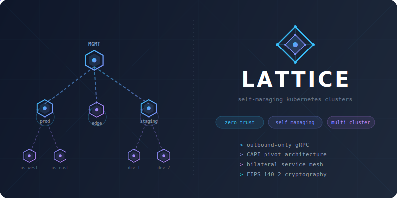

<p align="center">
  
</p>

<h3 align="center">Self-managing Kubernetes clusters with zero-trust networking</h3>

---

> **Sandbox project** — Lattice is a distributed systems sandbox for exploring self-managing Kubernetes clusters. It is not production-ready and is not offered as a product. Use it to learn, experiment, and prototype.

Lattice is a Kubernetes operator for multi-cluster lifecycle management. It provisions clusters via Cluster API, pivots them to be fully self-managing, and compiles high-level CRDs into everything a workload needs — with default-deny networking, Cedar policy authorization, and secret management built in.

**Key ideas:**

- **One CRD per workload** — LatticeService, LatticeJob, and LatticeModel each compile into Deployments, Services, NetworkPolicies, AuthorizationPolicies, ExternalSecrets, ScaledObjects, PVCs, Gateways, and more
- **Self-managing clusters** — every cluster owns its own CAPI resources after pivot and operates independently, even if the parent is deleted
- **Bilateral mesh** — traffic requires mutual consent (caller declares outbound, callee declares inbound), enforced at Cilium L4 + Istio L7
- **Cedar policies** — default-deny authorization for secret access with `forbid` overriding `permit`
- **Outbound-only architecture** — child clusters never accept inbound connections; all communication is via an outbound gRPC stream

## CRDs

| CRD | Purpose |
|-----|---------|
| **LatticeCluster** | Cluster lifecycle — provisioning, pivot, scaling, upgrades |
| **LatticeService** | Stateless/stateful services with mesh, secrets, ingress, autoscaling |
| **LatticeJob** | Distributed jobs with Volcano scheduling and training framework support |
| **LatticeModel** | Model serving with inference routing and autoscaling |
| **InfraProvider** | Cloud credentials (AWS, Proxmox, OpenStack, Docker) |
| **SecretProvider** | External secret backends (Vault, AWS Secrets Manager, webhook) |
| **CedarPolicy** | Authorization policies for secret access |
| **OIDCProvider** | Cluster-wide OIDC authentication |
| **LatticeClusterBackup** / **LatticeRestore** | Backup and restore via Velero |
| **BackupStore** | Backup storage targets (S3, GCS, Azure) |

## Quick Start

```bash
# Provision a self-managing cluster from a manifest
lattice install -f cluster.yaml

# Deploy services to the cluster
kubectl apply -f examples/webapp/

# Tear down a cluster
lattice uninstall -k /path/to/cluster-kubeconfig
```

See [examples/](examples/) for sample manifests and the [Getting Started](docs/guides/getting-started.md) guide for a full walkthrough.

## Documentation

- [Getting Started](docs/guides/getting-started.md) — install your first cluster
- [Core Concepts](docs/guides/core-concepts.md) — architecture, operator modes, pivot flow
- [Cluster Management](docs/guides/cluster-management.md) — providers, scaling, upgrades
- [Service Deployment](docs/guides/service-deployment.md) — LatticeService, LatticeJob, LatticeModel
- [Mesh Networking](docs/guides/mesh-networking.md) — bilateral agreements, multi-cluster mesh
- [Secrets Management](docs/guides/secrets-management.md) — ESO integration, five routing paths
- [Security](docs/guides/security.md) — Cedar policies, OIDC, network layers, FIPS
- [GPU Workloads](docs/guides/gpu-workloads.md) — distributed training, model serving
- [Backup & Restore](docs/guides/backup-restore.md) — Velero-based cluster and service backups
- [Operations](docs/guides/operations.md) — monitoring, observability, registry mirrors
- [CRD Reference](docs/reference/crd-reference.md) — complete field reference for all CRDs

## Development

```bash
cargo build              # Build all crates
cargo test               # Unit tests
cargo clippy             # Lint
cargo fmt -- --check     # Format check

# E2E tests (requires Docker)
cargo test --features provider-e2e --test e2e unified_e2e -- --nocapture
```

## License

See [LICENSE](LICENSE).
