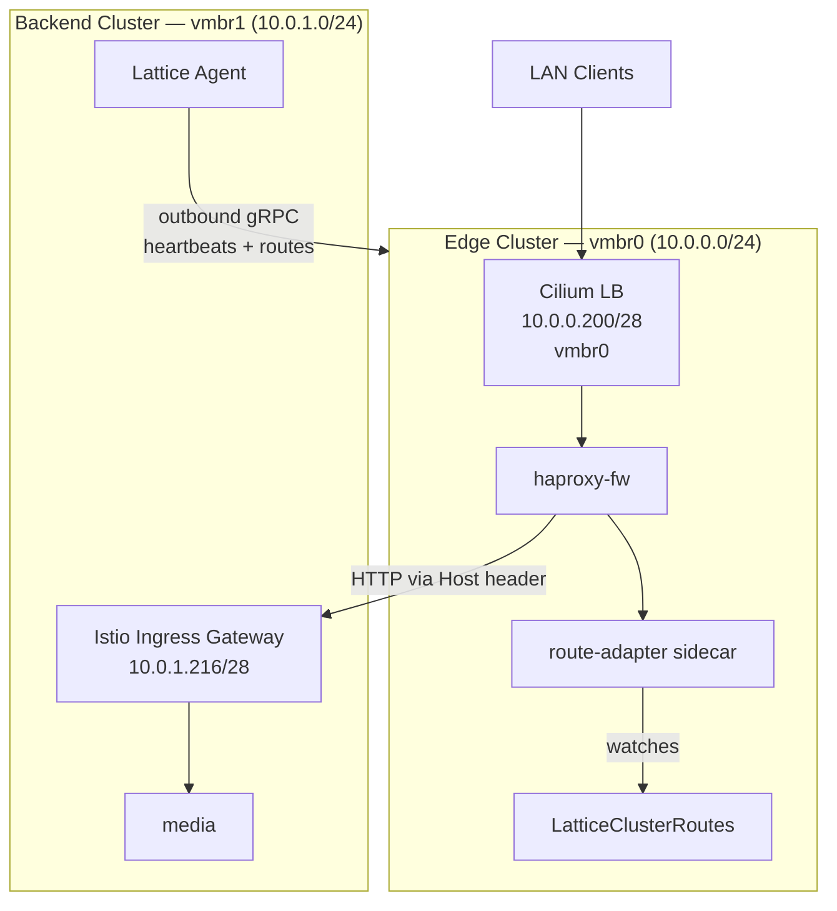

# Homelab: Edge HAProxy DMZ + Media Stack

Two-cluster Proxmox setup. The edge cluster runs HAProxy as a DMZ/firewall.
The backend cluster runs the media stack (jellyfin, sonarr, nzbget + VPN).
Routes are discovered automatically via heartbeats — no manual IP management.

See [lattice-homelab](https://github.com/evan-hines-js/lattice-homelab) for a live implementation of this setup.

## Architecture



**Network layout** (configured by `scripts/infra/proxmox-network-setup.sh`):

| Network | Subnet | Purpose | LAN-reachable |
|---------|--------|---------|---------------|
| vmbr0 | 10.0.0.0/24 | LB VIPs, kube-vip | Yes |
| vmbr0 VLAN 100 | 10.0.100.0/24 | Edge cluster nodes | No |
| vmbr1 | 10.0.1.0/24 | Backend cluster | No |

## How it works

- Backend services set `advertise: { allowedServices: ["*"] }` on ingress routes
- Route reconciler discovers these + resolves Gateway LB IPs
- Agent reads LatticeClusterRoutes CRD and heartbeats routes to parent
- Parent merges child routes into per-child LatticeClusterRoutes CRDs
- Istio multi-cluster: operator creates remote secrets + Service stubs
  so istiod discovers backend services natively
- HAProxy north-south: route-adapter sidecar watches the CRD, renders haproxy.cfg,
  and routes by Host header to backend ingress gateways via their LoadBalancer IPs

## Prerequisites

- Proxmox VE with an Ubuntu cloud-init template
- SSH key configured on the template
- Lattice operator installed on a bootstrap cluster (or use the edge cluster itself)
- `kubectl` and `docker` CLI tools
- A cert-manager `ClusterIssuer` named `homelab-selfsigned` (or change the issuer name in the media YAMLs)

## Before you start: customize the YAMLs

Edit these values in `edge-cluster.yaml` and `backend-cluster.yaml` to match your environment:

| Field | What to change |
|-------|---------------|
| `sshAuthorizedKeys` | Your SSH public key |
| `sourceNode` | Your Proxmox node name |
| `templateId` | Your cloud-init template ID |
| `controlPlaneEndpoint` | Free IP for kube-vip VIP |
| `ipv4Pool.range` | Free IP range for cluster nodes |
| `ipv4Pool.gateway` | Your network gateway |
| `dnsServers` | Your DNS server |
| `lbCidr` | Free IP range for LoadBalancer services |

Default IP allocation:

| Resource | Network | IP |
|----------|---------|-----|
| Edge VIP (kube-vip) | vmbr0 | 10.0.0.100 |
| Edge nodes | vmbr0 | 10.0.0.101-105 |
| Edge LB (Cilium) | vmbr0 | 10.0.0.200/28 |
| Backend VIP (kube-vip) | vmbr1 | 10.0.1.110 |
| Backend nodes | vmbr1 | 10.0.1.111-120 |
| Backend LB (Cilium) | vmbr1 | 10.0.1.216/28 |

These are offset from the E2E test fixtures (which use `.150-.155` and `.240/28`) so both can run on the same Proxmox host simultaneously. Run `scripts/infra/proxmox-network-setup.sh` on the Proxmox host first to create the bridges.

## Step 1: Create the InfraProvider

The clusters need Proxmox credentials. Create a Secret and InfraProvider on the bootstrap/edge cluster:

```bash
kubectl create secret generic proxmox-credentials \
  -n lattice-system \
  --from-literal=PROXMOX_URL=https://your-proxmox:8006/api2/json \
  --from-literal=PROXMOX_TOKEN_ID=lattice@pam!lattice \
  --from-literal=PROXMOX_SECRET=your-api-token-secret

kubectl apply -f - <<EOF
apiVersion: lattice.dev/v1alpha1
kind: InfraProvider
metadata:
  name: proxmox
spec:
  type: proxmox
  secretRef:
    name: proxmox-credentials
    namespace: lattice-system
EOF
```

## Step 2: Build and push the route-adapter image

```bash
cd route-adapter
docker build -t ghcr.io/evan-hines-js/lattice-route-adapter:latest .
docker push ghcr.io/evan-hines-js/lattice-route-adapter:latest
cd ..
```

## Step 3: Create the edge cluster

```bash
kubectl apply -f edge-cluster.yaml
kubectl wait --for=condition=Ready latticecluster/edge --timeout=20m
```

## Step 4: Deploy HAProxy on the edge

```bash
kubectl apply -f edge/namespace.yaml
kubectl apply -f edge/haproxy-fw.yaml
kubectl wait --for=condition=Ready latticeservice/haproxy-fw -n edge --timeout=5m
```

## Step 5: Create the backend cluster

The edge cluster provisions the backend:

```bash
kubectl apply -f backend-cluster.yaml
kubectl wait --for=condition=Ready latticecluster/backend --timeout=30m
```

## Step 6: Get the backend kubeconfig

```bash
# Extract from the proxy (recommended — preserves Cedar authorization)
BACKEND_KC=$(lattice kubeconfig backend)
# Or extract directly from the secret
BACKEND_KC=/tmp/backend-kubeconfig
kubectl get secret backend-kubeconfig -o jsonpath='{.data.value}' | base64 -d > $BACKEND_KC
```

## Step 7: Deploy the media stack on the backend

```bash
kubectl --kubeconfig=$BACKEND_KC apply -f backend/media/namespace.yaml
kubectl --kubeconfig=$BACKEND_KC apply -f backend/media/
```

## Step 8: Configure DNS

Find the edge HAProxy LoadBalancer IP:

```bash
kubectl get svc -n edge -l lattice.dev/service=haproxy-fw -o jsonpath='{.items[0].status.loadBalancer.ingress[0].ip}'
```

Add to your router's DNS or `/etc/hosts`:

```
<edge-lb-ip>  jellyfin.home.arpa
<edge-lb-ip>  sonarr.home.arpa
<edge-lb-ip>  nzbget.home.arpa
```

## Step 9: Verify

```bash
# Check routes propagated from backend to edge
kubectl get latticeclusterroutes

# Check all services are Ready on backend
kubectl --kubeconfig=$BACKEND_KC get latticeservices -A

# Access UIs
curl http://jellyfin.home.arpa
curl http://sonarr.home.arpa
```

## Customization

- **VPN egress**: Edit the wireguard sidecar config in `backend/media/nzbget.yaml` with your WireGuard credentials
- **Storage sizes**: Adjust `size` in volume resources
- **VM sizing**: Edit `instanceType` in cluster YAMLs
- **Restrict access**: Change `allowedServices: ["*"]` to specific callers like `["edge/edge/haproxy-fw"]`
